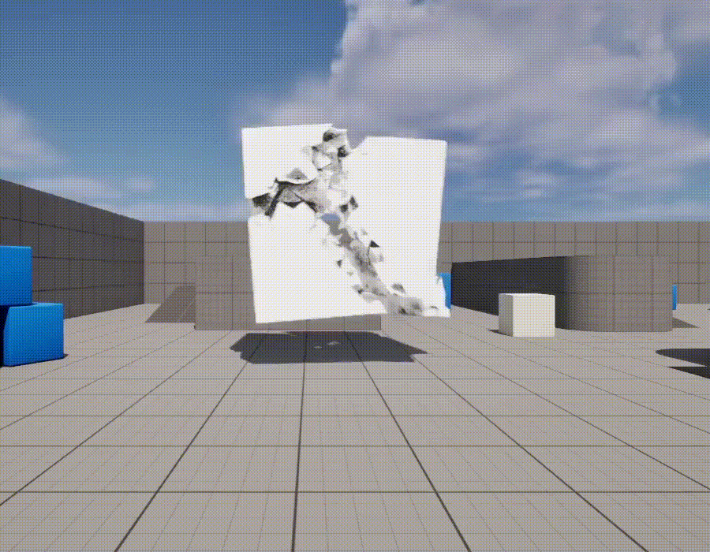
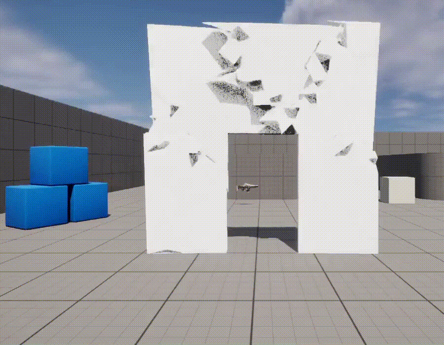
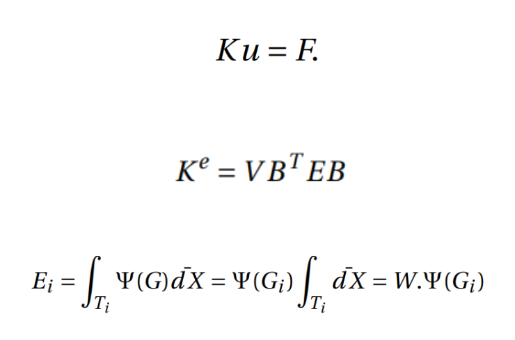
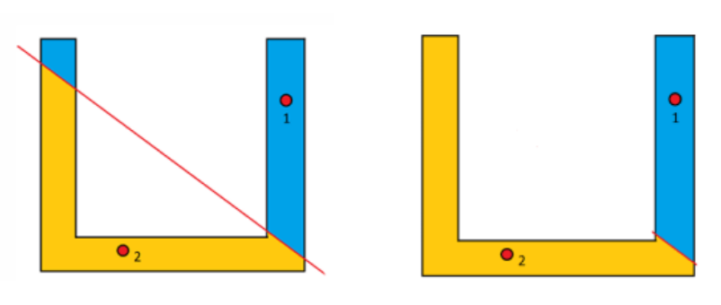
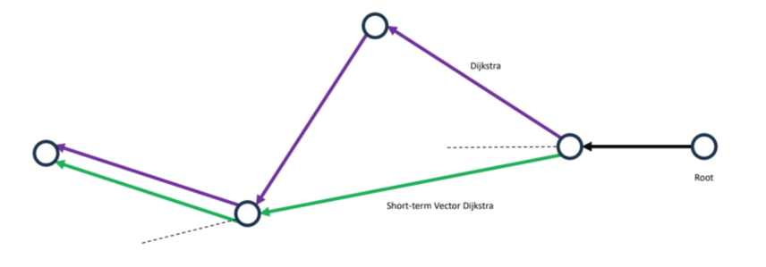
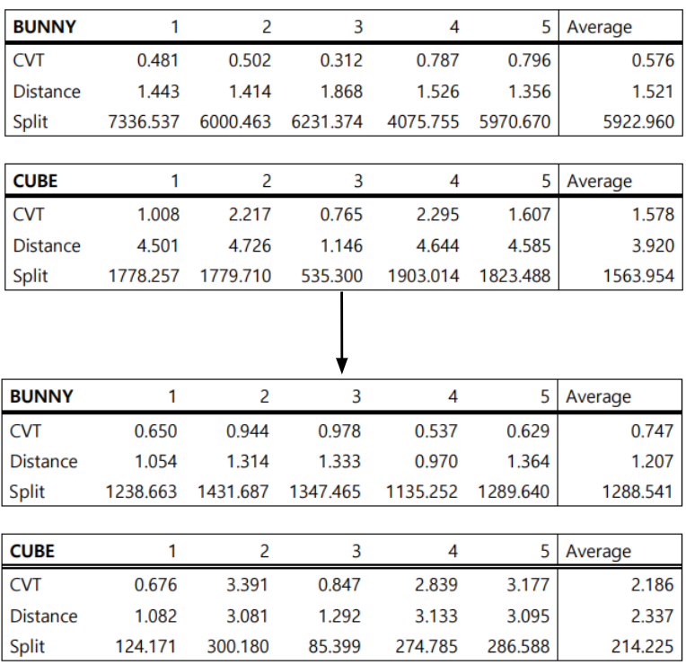

# Real-Time Dynamic Destruction in Unreal Engine 5
2024년 2학기 경희대학교 소프트웨어융합학과 게임 콘텐츠 캡스톤 디자인 프로젝트입니다.

프로젝트 시연 Gif

  
  

## 프로젝트 개요
본 프로젝트는 언리얼 엔진 5 환경에서 동작하는 **실시간 동적 파괴 시스템(Real-Time Dynamic Destruction System)**을 C++로 구현한 것입니다. 기존 게임 엔진이 제공하는 '사전 분할(Pre-fractured)' 방식의 한계를 극복하고, 충격 지점과 힘에 따라 런타임에 실시간으로 파괴 패턴이 생성되는 더 사실적이고 몰입감 있는 파괴 효과를 구현하는 것을 목표로 합니다.

## 문제 인식: 기존 파괴 시스템의 한계
언리얼 엔진 5의 카오스 디스트럭션 시스템은 매우 강력하지만, 대부분 사전 분할 방식에 의존합니다. 이는 다음과 같은 명확한 한계를 가집니다.

반복성: 충격의 종류와 위치에 상관없이 항상 미리 정해진 동일한 형태로만 파괴됩니다.
비현실성: 플레이어의 상호작용이 파괴 결과에 직접적인 영향을 주지 못해 예측 가능하고 부자연스러운 느낌을 줍니다.

## 제시하고자 한 해결책: 실시간 동적 파괴 파이프라인
저희는 이러한 한계를 극복하기 위해 다음과 같은 핵심 기술들을 융합한 파이프라인을 구축했습니다.

1. 물리 기반 분석: 유한요소법(FEM)을 경량화하여 사용했습니다. 물체가 충격 시 객체가 받는 충격량을 실시간으로 계산합니다.
  
2. 고급 메시 분할 알고리즘: 단순한 유클리드 거리가 아닌 그래프 거리(Graph Distance) 기반의 보로노이 다이어그램을 생성하여 복잡하고 오목한(Non-convex) 형태의 메시도 자연스럽게 분할합니다.
 
3. 최적화된 파괴 패턴 생성: CVT(Centroidal Voronoi Tessellation) 이터레이션을 통해 더욱 균일하고 자연스러운 파괴 조각을 생성합니다.
  
4. 런타임 메시 생성: 분할된 결과를 바탕으로 **프로시저럴 메시(Procedural Mesh)**를 런타임에 생성하여 파괴된 객체를 즉시 렌더링합니다.

## 핵심 기술 및 구현 내용 (Core Features & Technical Details)

1. 유한요소법(FEM) 적용 및 경량화

물리적 특성을 파괴 효과에 반영하기 위해 유한요소법(FEM)을 도입했습니다.

사면체 메시(Tetrahedral Mesh): 객체의 내부까지 표현하고 부피를 가질 수 있는 사면체 메시를 사용하여 FEM 계산의 기반을 하였습니다. 
사면체 메시 전환을 위해 fTetWild 라이브러리를 사용했습니다. https://github.com/wildmeshing/fTetWild

  실시간 에너지 계산: 런타임 중 높은 계산 비용을 피하기 위해, 충격 지점 주변의 가장 가까운 사면체에 대해서만 Ku=F 행렬 방정식을 계산하여 에너지를 근사하는 경량화된 접근법을 사용했습니다. 이를 통해 실시간성을 확보하면서도 물리 기반의 파괴 임계값을 결정할 수 있었습니다.

2. 그래프 거리 기반 보로노이 다이어그램
  기존 유클리드 거리 기반 보로노이 다이어그램은 'U'자 형태처럼 오목한(Non-convex) 객체에 적용할 때 객체 외부를 가로지르는 비현실적인 셀을 생성하는 문제가 있습니다.
  

3. 그래프 거리 계산: 이 문제를 해결하기 위해, 객체 내부의 사면체 메시를 그래프로 모델링하고, **메시 표면을 따라가는 최단 경로(그래프 거리)**를 계산했습니다.

Short-term Vector Dijkstra: 최단 경로 계산을 위해 기본 다익스트라 알고리즘에 경로의 방향성까지 평가하는 'Short-term Vector Dijkstra' 알고리즘을 적용하여 더 자연스러운 셀 경계를 생성했습니다.

좌: 유클리드 거리 기반의 잘못된 셀 생성 / 우: 그래프 거리 기반의 정확한 셀 생성

3. CVT(Centroidal Voronoi Tessellation) Iteration
  무작위로 생성된 보로노이 셀은 때때로 지나치게 뾰족하거나 불균일하여 부자연스러운 파편을 만듭니다.

  Lloyd 알고리즘: 이를 개선하기 위해 각 보로노이 셀의 무게중심으로 시드(seed)를 재배치하는 과정을 반복하는 Lloyd 알고리즘을 적용했습니다. 이 과정을 통해 더 둥글고 균일하며 자연스러운 형태의 파괴 조각을 생성할 수 있었습니다.

4. 병렬 처리를 통한 성능 최적화
  프로젝트 초기, 가장 큰 병목 현상은 메시 분할(Split) 과정에서 발생했습니다. 복잡한 메시의 경우 파괴에 수 초가 소요되어 실시간 적용이 불가능했습니다.
  
  멀티스레딩 도입: 이 문제를 해결하기 위해 언리얼 엔진의 ParallelFor와 Async를 사용하여 데이터 병렬 처리를 구현했습니다.

## 성능 향상 결과

최적화 결과, 복잡한 메시(Bunny)에서 4.6배, 단순한 메시(Cube)에서 7.3배의 속도 향상을 달성하여 실시간성을 확보했습니다.

Sheets로 내보내기
## 프로젝트 구조 아키텍처 
프로젝트는 다음과 같은 C++과 블루프린트 클래스들로 이루어집니다.

BP_TestActor: 실제 월드에 배치되어 충돌 이벤트를 감지하는 액터 블루프린트입니다.

VoroTestComponent: 충돌 에너지를 받아 파괴 프로세스 전체를 관리하는 핵심 컴포넌트입니다.

FEMCalculateComponent: 충돌 시 물리적 에너지를 계산합니다.

WeightedGraph / DistanceCalculate: 그래프 구조를 생성하고, 그래프 거리를 계산합니다.

CVT: CVT 이터레이션을 수행하여 보로노이 시드를 최적화합니다.

SplitMesh: 계산된 결과를 바탕으로 실제 사면체 및 메시를 분할합니다.

SplitActor: 분할된 프로시저럴 메시를 받아 새로운 액터를 생성합니다.

## 향후 개선점 (Future Improvements)
에디터 툴 개발: 런타임에 수행되는 사면체 메시 변환 과정을 에디터 유틸리티 위젯으로 개발하여, 레벨 로딩 시의 성능 부하를 줄이고 개발 편의성을 높일 수 있습니다.

VFX 및 SFX 적용: 언리얼 엔진의 나이아가라 시스템과 연동하여 파편, 먼지, 연기 등 시각 효과와 사운드 효과를 추가하면 파괴 효과의 몰입감을 극대화할 수 있습니다.

추가 최적화: 메시 분할 알고리즘을 더욱 개선하여 더 복잡하고 디테일한 객체도 실시간으로 파괴할 수 있도록 연구를 계속할 수 있습니다.

## 팀원 (Team)
서범준 (팀장): 유한요소법(FEM) 계산 알고리즘 개발

박제홍: CVT 알고리즘, 그래프 에너지 전파 알고리즘 개발, 시스템 통합

정찬일: 가중치 그래프, 최단 거리 알고리즘, 사면체 절단 및 메시 분리 개발
